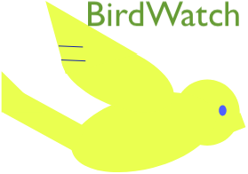
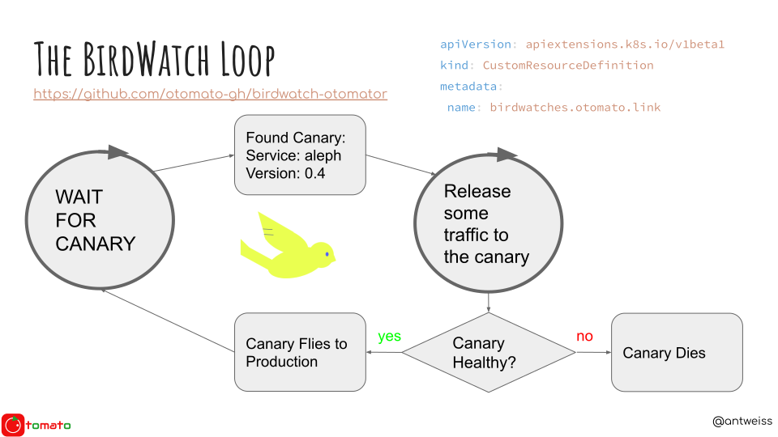

# BirdWatch Otomator 

A python-based K8S controller to manage canary releases with Istio service mesh

Supports querying Prometheus for canary health metrics.

Can be configured to send Slack notifications.

Install with helm by running: `helm install ./helm --name birdwatch --set slackToken=<your-slack-token> --set prometheusUrl=<your-prometheus-url>`

If prometheusUrl isn't provided - tries to queriy Istio-provided Prometheus

## How this works:

The **otomator** sits in your cluster and listens for new canary deployment. When a new canary is discovered, otomator sends a healthcheck query (defined in the BirdWatch resource) to Prometheus.

The first received healthcheck `metric` is considered the baseline.

Otomator then starts releasing traffic on to canary pods according to the defined `increment` and `interval`. After each increment the healthcheck metric is queried again. 

If at any point the returned metric deviates from the baseline more than allowed by the `deviation` BirdWatch property, the otomator performs the action that is defined by the `if_unhealthy` property of the BirdWatch. I.e:

- If it is set to `rollback` - all traffic goes back to the current production version.
- If it is set to `freeze` - the canary is left with however much traffic it was receiving. The engineer who sees the Slack notification can then go in and analyze the situation.   

If no deviation occurs - the traffic is gradually released to the canary until finally it is promoted to become the production version.

## A Diagram

This diagram represents how the BridWatch *otomator* works:


## The BirdWatch resource

In order for a deployment to be considered a canary it has to be accompanied by a *BirdWatch* custom resource.

The API for a BirdWatch is as follows:
```yaml
openAPIV3Schema:
      properties:
        spec:
          properties:
            service: # Istio virtualservice name
              type: string
            metric:  # A query to send to Prometheus for service health check
              type: string
            deviation: # What deviation from starting metric is allowed
              type: number
              format: float
            increment: # Increments in canary traffic
              type: integer
              minimum: 1
              maximum: 10
            canary_version: # The version of canary pod
              type: string
            if_unhealthy: # If to freeze or rollback when canary is sick
              type: string
              pattern: '^(freeze|rollback)$'
            interval: # Time between traffic increments
              type: integer
              minimum: 1
              maximum: 600
```

An example of a BirdWatch for service named `aleph` with canary version `v04` :

```yaml
apiVersion: otomato.link/v1alpha1
kind: BirdWatch
metadata:
  name: aleph
spec:
  canary_version: v04
  if_unhealthy: rollback
  increment: 1
  interval: 5
  metric: sum(irate(istio_requests_total{destination_service_name="aleph",destination_version="v04",response_code="500"}[30s]))
  service: aleph
  deviation: 0.5
```

We'll be adding more examples to the [examples](examples) folder soon.

## Building the Docker image

```bash
docker build .
```

## Contributing

All pull requests are more than welcome!

This is currently more of a POC and can use loads of enhancements.

Some ideas:

- Check that k8s deployment for the canary is even in `available` status before querying Prometheus

- Support additional monitoring systems (currently only Prometheus)

- Support additional notification systems (currently only Slack)

- Check that Prometheus is available on startup

- Allow to define the upper limit for canary traffic


